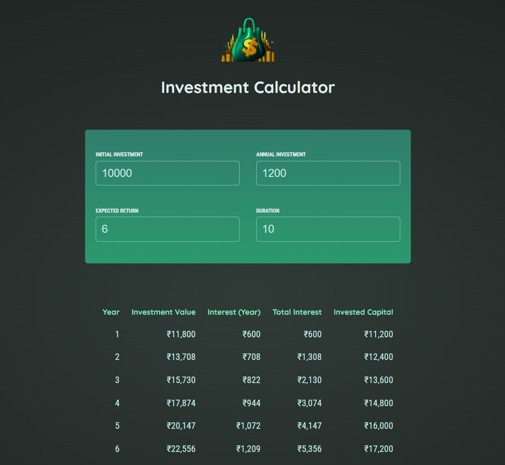

<h1 align="center">💰 Investment Calculator (ReactJS)</h1>

## 🚀 Tech Stack & Concepts

This project is built using **ReactJS** and focuses on core React concepts:

- ✅ **ReactJS Fundamentals**
- 🔄 **Working with React components**
- 🧠 **Managing state with `useState`**
- ⬆️ **Lifting state up**
- 🧮 **Calculating investment returns**
- 🧩 **Reusable components and clean structure**
- 🎨 **Responsive & styled UI**

## 🔗 Demo

- 👉 <a target="_blank" href="https://shl-react-investment-calculator.netlify.app/">Click here</a> to try the Investment Calculator live!



This calculator helps users project the future value of their investments based on compound interest. Simply enter your initial savings, yearly contribution, expected return, and duration — and watch the numbers work their magic.

---

## 📖 How to Use

To get this project running locally, you'll need [Git](https://git-scm.com/downloads) and [ReactJS](https://react.dev/) installed.

```bash
# 1. Clone the repository
git clone https://github.com/shashankhl/react-investment-calculator.git

# 2. Navigate to the project directory
cd react-investment-calculator

# 3. Install dependencies
npm install

# 4. Start the development server
npm start
```

## :mailbox: Contact

- <a target="_blank" href="www.linkedin.com/in/shashank-hl">LinkedIn</a>
